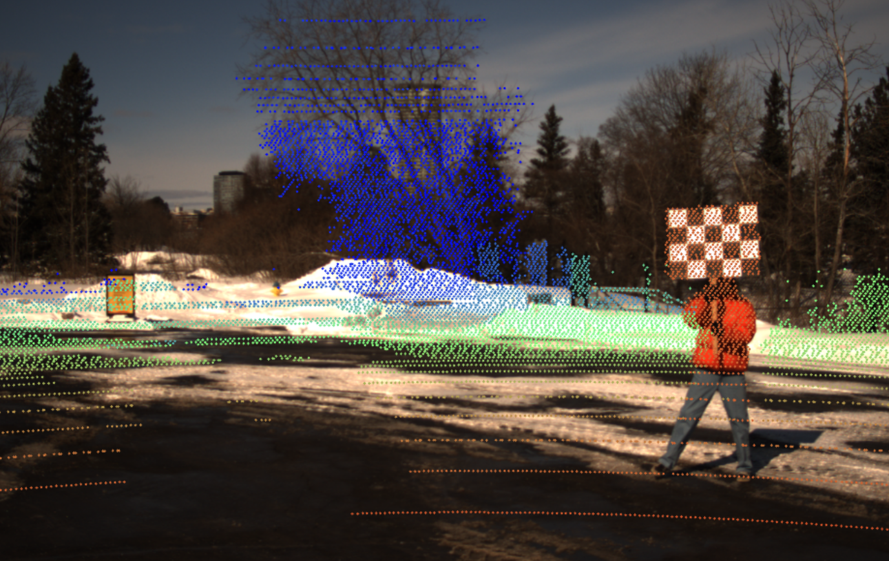

# 🚗 Multi-Frame LiDAR–Camera Calibration & Overlay

This repository provides a workflow for calibrating LiDAR and cameras using multiple frames, synchronizing datasets, visualizing the results, and generating overlay videos.

This project is **based on the original work of Aziz Al-Najjar**.  
The code and workflow in this repository were adapted and extended from his LiDAR–camera calibration and multi-camera projection project.

---

## 🙏 Acknowledgment

This project is based on the original work by **Aziz Al-Najjar**.

Credit for the foundational calibration and projection workflow goes to **Aziz Al-Najjar** and the original project this repository builds on.  
This version extends that work with:
- stricter timestamp-based frame matching
- multi-frame calibration
- improved visualization scripts
- overlay video generation utilities

---

## 📸 Demo Previews
### Driving Through Campus with LiDAR Overlay


### Checkerboard Calibration Demo


### Example Primary Camera Overlay


### Example Secondary Camera Overlay


---

## 📁 Repository Structure

```text
.
├── visuals/
├── .gitignore
├── .polyscope.ini
├── KISS-ICP_Documentation.md
├── LICENSE
├── ReadME.md
├── make_secondary_overlay_video.py
├── multiframe_calibration.py
├── multiframe_primary_calibration.txt
├── multiframe_secondary_calibration.txt
├── prepare_bag_export_strict.py
├── requirements.txt
└── visualize_multiframe_result.py
````

---

## ⚙️ Installation

```bash
git clone https://github.com/<your-username>/<repo-name>.git
cd Multiframe-pointcloud-registeration-and-multi-camera-projection

python -m venv venv
venv\Scripts\activate   # Windows
# source venv/bin/activate  # macOS/Linux

pip install -r requirements.txt
```

---

## 📂 Data Format

### Input format from bag export

```text
bag_export/
├── lidar/
│   ├── frame_000000.pcd
│   ├── frame_000000_timestamp.txt
│   └── ...
├── primary_camera/
│   ├── frame_000000.png
│   ├── frame_000000_timestamp.txt
│   └── ...
├── secondary_camera/
│   ├── frame_000000.png
│   ├── frame_000000_timestamp.txt
│   └── ...
```

### Strict synchronized output format

```text
bag_export_strict/
├── PointCloudsIntensity/
│   ├── 000000.pcd
│   └── ...
├── primaryImages/
│   ├── 000000.png
│   └── ...
├── secondaryImages/
│   ├── 000000.png
│   └── ...
```

---

## 🔧 Scripts Overview

### `prepare_bag_export_strict.py`

Synchronizes LiDAR and camera frames using timestamps.

**Purpose**

* Match LiDAR frames with primary and secondary camera frames
* Remove frames without good timestamp matches
* Create a calibration-ready strict dataset

**Usage**

```bash
python prepare_bag_export_strict.py --input "C:\Users\Michael\Desktop\bag_export" --output "C:\Users\Michael\Desktop\bag_export_strict"
```

---

### `multiframe_calibration.py`

Performs **multi-frame manual camera–LiDAR calibration**.

**Purpose**

* Select multiple frames across a dataset
* Choose corresponding LiDAR and image points
* Solve one final transform using all selected correspondences

**Default workflow**

* 10 frames
* 4 point pairs per frame
* 40 total correspondences used for final calibration

**Usage**

```bash
python multiframe_calibration.py --camera primary --data_dir "C:\Users\Michael\Desktop\bag_export_strict"
```

```bash
python multiframe_calibration.py --camera secondary --data_dir "C:\Users\Michael\Desktop\bag_export_strict"
```

**Outputs**

* `multiframe_primary_calibration.txt`
* `multiframe_secondary_calibration.txt`

---

### `visualize_multiframe_result.py`

Projects LiDAR points onto a single image frame using a saved calibration file.

**Purpose**

* Validate calibration visually
* Inspect projection quality on individual frames
* Check whether LiDAR points align correctly with image structures

**Usage**

```bash
python visualize_multiframe_result.py --camera secondary --frame 279 --data_dir "C:\Users\Michael\Desktop\bag_export_strict" --calib_file multiframe_secondary_calibration.txt
```

---

### `make_secondary_overlay_video.py`

Creates a full overlay video using the **secondary camera** calibration.

**Purpose**

* Project LiDAR onto every secondary camera frame
* Save overlay images
* Export a video across the full sequence

**Usage**

```bash
python make_secondary_overlay_video.py --data_dir "C:\Users\Michael\Desktop\bag_export_strict" --calib_file multiframe_secondary_calibration.txt --output_video "secondary_overlay_video.mp4"
```

**Optional arguments**

```bash
--display_scale 0.5
--point_radius 2
--max_depth 30
```

---

## 🧠 Recommended Workflow

### 1. Export raw bag data

Create:

```text
bag_export/
```

### 2. Synchronize frames strictly

```bash
python prepare_bag_export_strict.py --input "C:\Users\Michael\Desktop\bag_export" --output "C:\Users\Michael\Desktop\bag_export_strict"
```

### 3. Run calibration

```bash
python multiframe_calibration.py --camera primary --data_dir "C:\Users\Michael\Desktop\bag_export_strict"
python multiframe_calibration.py --camera secondary --data_dir "C:\Users\Michael\Desktop\bag_export_strict"
```

### 4. Visualize a single frame

```bash
python visualize_multiframe_result.py --camera secondary --frame 279 --data_dir "C:\Users\Michael\Desktop\bag_export_strict" --calib_file multiframe_secondary_calibration.txt
```

### 5. Generate overlay video

```bash
python make_secondary_overlay_video.py --data_dir "C:\Users\Michael\Desktop\bag_export_strict" --calib_file multiframe_secondary_calibration.txt --output_video "secondary_overlay_video.mp4"
```

---

## 📊 Key Features

* Multi-frame LiDAR–camera calibration
* Strict timestamp-based sensor synchronization
* Manual correspondence selection across multiple frames
* 3D LiDAR to 2D image projection
* Overlay visualization and video generation
* Based on the original project by **Aziz Al-Najjar**

---

## ⚠️ Notes

* LiDAR files in this workflow are handled as plain-text XYZI data.
* Calibration quality depends heavily on selecting well-distributed, accurate correspondences.
* For best results:

  * choose points spread across the image
  * use features at different depths
  * avoid moving objects
  * use checkerboard corners when available

---

## 👨‍💻 Credits

**Original project foundation:** Aziz Al-Najjar
**Extended / adapted workflow:** Matthew Ramsey

This repository builds directly on Aziz Al-Najjar’s original LiDAR–camera calibration and projection work and extends it with additional synchronization, visualization, and multi-frame calibration utilities.
